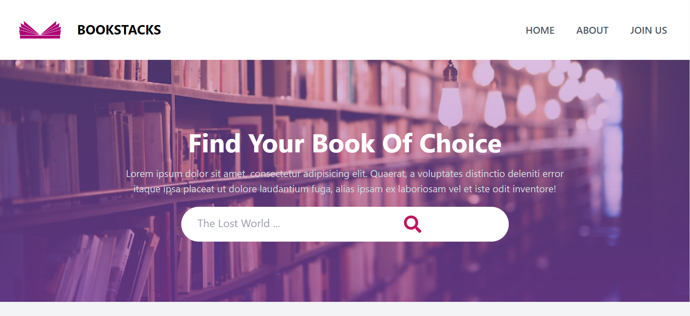

# BOOKSTACKS

BookStacks is a web application for managing and organizing your personal book collection. It allows you to keep track of the books you own, the books you've read, and the books you want to read. You can also discover new books, explore recommendations, and connect with other book enthusiasts.



## FEATURES

- **Book Management:** Add books to your collection, mark books as read, and track your reading progress.
- **Wishlist:** Keep a wishlist of books you want to read or add to your collection in the future.
- **Discover:** Explore a curated selection of book recommendations based on different genres and topics.
- **Search:** Search for books by title, author, or ISBN to quickly find and add them to your collection.
- **Community:** Connect with other users, share book reviews, and participate in discussions.
- **User Profiles:** Customize your profile, view your reading statistics, and see your bookshelf.

## INSTALLATION

1. Clone the repository:

```bash
git clone https://github.com/JatinSinghBisht01/BOOKSTACKS.git
```

2. Install the dependencies:

```bash
cd BOOKSTACKS
npm install
```

3. Configure the environment variables:

```bash
cp .env.example .env
```

Edit the `.env` file and provide the necessary values for your environment.

4. Start the development server:

```bash
npm start
```

The application should now be running at `http://localhost:3000`.

## Technologies Used

- **Frontend:** React, Redux, Tailwind CSS
- **Backend:** Node.js, Express.js
- **Database:** MongoDB
- **Authentication:** JSON Web Tokens (JWT)
- **API Integration:** OpenLibrary API, Goodreads API

## CONTRIBUTING

Contributions are welcome! If you have any ideas, bug fixes, or improvements, feel free to submit a pull request. Please make sure to follow the [code style guidelines](CONTRIBUTING.md) and provide detailed descriptions of your changes.

## LICENSE

This project is licensed under the [MIT License](LICENSE).

---
